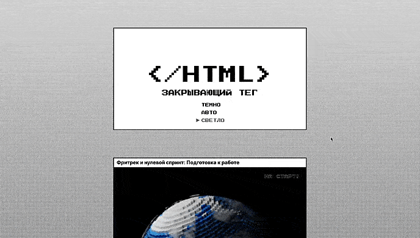

# #️⃣ ЗАКРЫВАЮЩИЙ ТЕГ
Итоговый проект по вёрстке. В нём подведены мои личные итоги четырёх спринтов. Здесь я вспомнила и проанализировала свои эмоции и ощущения на разных этапах обучения.

**[Посмотреть страницу ⬅️](https://khimichek.github.io/zakrivayuschiy-teg-f/)**

**[Ссылка на макет Figma](https://www.figma.com/design/wlEuATONOV9beiWvy77RIx/)**

## Что было сделано?

**1. Цветовые схемы.** Реализована функция переключения между dark и default режимами. Поддерживаемые цветовые схемы описаны в метатеге.  
**2. Адаптивный SVG-фавикон** с внутренними стилями, где значение fill у кривых изменяется в зависимости от выбранной темы.  
**3. Фиксированное фоновое изображение** с градиентом, реализованное через background-color и background-image.  
**4. Различные анимации, такие как:**
* Стрелка в меню
* Кнопки Like и «Сохранить на память», которые меняют цвет текста через mix-blend-mode.
* SVG-иконка сердца с группами и path, именованными через классы.  

**5. Модальное окно**, реализованное с помощью элемента dialog.  
**6. Карточки** с лейблом и изображениями, стилизованными с помощью CSS-фильтров.

## Технологии
* HTML, CSS, JavaScript

## Установка и запуск

1. Склонируйте репозиторий: **https://github.com/Khimichek/zakrivayuschiy-teg-f.git**
2. Перейдите в папку проекта: `cd your-repo`
3. Откройте **index.html** в вашем браузере, чтобы увидеть веб-сайт.
